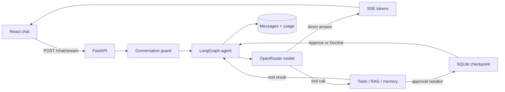

# LazyChat

**Big questions. Tiny robot energy.**

LazyChat is a complete, stateful LLM agent presented as an interactive portfolio project. The backend combines FastAPI, LangGraph, OpenRouter, SQLite, FAISS, external tools, document retrieval, streaming, usage accounting, and human approval. The React interface makes those systems visible instead of hiding them behind a generic chat box.

## Authorship

- **Original backend, project conception, and supervision:** Subramanian.
- **Frontend design and implementation:** AI-assisted, under Subramanian's supervision.
- **Backend integration fixes and usage instrumentation:** AI-assisted; documented individually in [BACKEND_CHANGES.md](BACKEND_CHANGES.md).

Suggested portfolio description:

> Built a conversational AI backend with FastAPI, LangGraph, SQLite, and FAISS, supporting tool use and document retrieval. Directed an AI-assisted React frontend with streaming chat, responsive layouts, human approval controls, visible tool activity, and provider-reported token and cost tracking.

## What the application can do

### Chat and interface

- Stream model output token by token and render GitHub-flavored Markdown, code, tables, lists, links, and quotes.
- Switch between the backend's allowed OpenRouter models without exposing credentials to the browser.
- Save conversations, reopen them by URL, search conversation titles, start a clean thread, and export a chat as Markdown.
- Show clear loading, empty, upload, partial-usage, interrupted, failed, and recovered states.
- Work on desktop, tablet, and mobile with keyboard navigation, focus indicators, reduced-motion support, and accessible labels.
- Use a warm illustrated field-guide design with cream paper, forest green, peach and yellow cards, locally hosted typography, offset shadows, hand-drawn accents, and an original LazyBot SVG mascot.

### Agent behavior

- Run a LangGraph loop that lets the model answer directly or call one or more tools before producing the final response.
- Display real tool names, JSON arguments, running/paused/completed/error states, and expandable tool results in the conversation.
- Persist LangGraph checkpoints per conversation so state survives page refreshes and server restarts.
- Pause the graph inside the demonstration stock tool, surface the pending action, and resume the exact interrupt after an explicit Approve or Decline decision.
- Keep long-term memories and document retrieval isolated by conversation ID.
- Prevent overlapping requests in the same conversation while allowing different conversations to run independently in the single-worker setup.

### Documents, persistence, and observability

- Upload PDF, TXT, Markdown, CSV, and DOCX files up to 20 MB by button or drag and drop.
- Split documents, create OpenRouter embeddings, save a per-conversation FAISS index, and retrieve the three most relevant chunks.
- Store conversations, messages, memories, and usage records in SQLAlchemy-managed SQLite tables.
- Track provider-reported input tokens, output tokens, total tokens, model calls, missing reports, and USD cost for each execution segment.
- Aggregate usage by message, conversation, and workspace, including multi-call tool loops and both sides of a human-approval pause.

## Available agent tools

| Tool | What it does | External service |
| --- | --- | --- |
| `tavily_search` | Searches current web information and returns up to three advanced results | Tavily |
| `get_weather` | Returns current condition, temperature, humidity, pressure, wind, and visibility for a city | OpenWeather |
| `calculator` | Evaluates a restricted mathematical expression | None |
| `get_current_time` | Returns the server's current local date and time | None |
| `get_current_date` | Returns the server's current date | None |
| `get_stock_price` | Retrieves daily stock data for a ticker | Alpha Vantage |
| `retriever_tool_func` | Searches the document attached to the current conversation | OpenRouter embeddings + local FAISS |
| `buy_stocks` | Demonstrates a checkpointed human approval; it never places a real trade | None; simulation only |
| `save_memory_to_db` | Saves a long-term memory inside the current conversation | Local SQLite |
| `search_memory` | Reads saved memories from the current conversation | Local SQLite |

## Stack and structure

**Frontend:** React, TypeScript, Vite, Lucide icons, React Markdown, remark-gfm, locally bundled Bricolage Grotesque, Manrope and Kalam fonts, an original SVG mascot, and custom CSS. No Node server is required after the frontend is built.

**Backend:** FastAPI, LangGraph, LangChain, OpenRouter, SQLAlchemy, SQLite, and FAISS.

```text
lazychat/
|-- app.py                  # FastAPI routes and built frontend serving
|-- agent.py                # Existing model configuration and LangGraph agent
|-- tools.py                # Search, weather, calculations, memory, retrieval
|-- database.py             # Conversations, messages, memories, usage records
|-- memory.py               # SQLite LangGraph checkpoints
|-- rag.py                  # Document loading, embeddings, and FAISS retrieval
|-- usage.py                # Provider usage adapter and per-turn accounting
|-- frontend/
|   |-- src/
|   |   |-- App.tsx         # Workspace UI and conversation interactions
|   |   |-- api.ts          # API types, requests, and streaming parser
|   |   |-- api.test.ts     # Streaming transport tests
|   |   |-- App.test.tsx    # Simulated-DOM interaction tests
|   |   |-- main.tsx        # React entry point and local fonts
|   |   |-- LazyBot.tsx     # Original inline SVG mascot
|   |   |-- ToolActivity.tsx # Plain-text tool execution trace
|   |   |-- styles.css      # Base layout and responsive rules
|   |   `-- portfolio-theme.css # Illustrated field-guide theme and controls
|   |-- public/favicon.svg
|   |-- package.json
|   |-- package-lock.json
|   `-- vite.config.ts      # Local API proxy and production build
|-- templates/index.html    # Setup guidance before the frontend is built
|-- tests/test_api.py       # Offline backend integration tests
|-- src/full_chatbot/       # Original starter Python package
|-- pyproject.toml          # Python dependencies
|-- uv.lock                 # Locked Python dependency versions
|-- requirements.txt        # Older, less complete dependency list
`-- BACKEND_CHANGES.md      # Exact integration changes and usage semantics
```

## How one request moves through LazyChat



1. The frontend sends the message, conversation ID, and selected model to `POST /chat/stream`.
2. FastAPI validates the request and claims only that conversation ID. A second request for the same thread receives HTTP 409 until the first one releases it.
3. LangGraph restores that conversation's checkpoint and calls the model with the system prompt, message history, and bound tools.
4. A direct answer streams to the browser. If the model requests a tool, LangGraph runs it and sends its result back to the model before the final answer.
5. Tool calls and results are also emitted as structured SSE events, which the frontend renders as the visible tool trail.
6. `buy_stocks` calls LangGraph's `interrupt()`. The checkpoint is saved and the API returns the exact interrupt ID and payload to the interface.
7. Approve or Decline sends a `Command(resume=...)` for that ID. The graph resumes from SQLite without adding the user's original message twice.
8. The assistant message and provider-reported usage are saved. The conversation guard is released even when an error or disconnect occurs.

## Models

The model selector is populated from the backend allowlist:

- `openai/gpt-4o`
- `openai/gpt-4o-mini`
- `openai/gpt-4-turbo`
- `openai/gpt-3.5-turbo`
- `google/gemini-2.0-flash-exp`

The names describe routing choices configured in this repository. Actual availability depends on OpenRouter. A resume request keeps the model that created the checkpoint, even if the browser submits a different model.

## Run locally

You need **Git**, **Python 3.13**, **uv**, and **Node.js 22.12+** with npm.

### 0. Get the project and enter its directory

If you cloned it from GitHub:

```powershell
git clone https://github.com/YOUR_USERNAME/YOUR_REPOSITORY.git
cd YOUR_REPOSITORY
```

If the project is already on your computer, open a terminal in its root—the folder containing `pyproject.toml` and `frontend/`.

### 1. Install Python dependencies

```powershell
uv sync --locked
```

Use `pyproject.toml` and `uv.lock` for this application; the older `requirements.txt` does not include all direct FastAPI dependencies.

### 2. Configure your API keys

Create a local `.env` file:

```dotenv
OPENROUTER_API_KEY=your_openrouter_api_key
TAVILY_API_KEY=your_tavily_api_key
CHATBOT_DATA_DIR=./data

# Optional, for their corresponding tools
OPENWEATHER_API_KEY=your_openweather_api_key
ALPHAVANTAGE_API_KEY=your_alphavantage_api_key
```

OpenRouter and Tavily keys are needed by components initialized at startup. Chat and document processing require access to the configured provider. Do not put API keys in frontend files or `VITE_` environment variables. `.env` is excluded from Git.

Key responsibilities:

| Variable | Required | Used for |
| --- | --- | --- |
| `OPENROUTER_API_KEY` | Yes | Chat completions and document embeddings |
| `TAVILY_API_KEY` | Yes | Web-search tool initialized at startup |
| `CHATBOT_DATA_DIR` | Recommended | LangGraph checkpoint database location |
| `OPENWEATHER_API_KEY` | Only for weather | Current weather tool |
| `ALPHAVANTAGE_API_KEY` | Only for stocks | Stock-price tool |

### 3. Build the frontend

```powershell
cd frontend
npm ci
npm run build
cd ..
```

### 4. Start LazyChat

```powershell
uv run uvicorn app:app --host 127.0.0.1 --port 8000
```

Open [LazyChat](http://127.0.0.1:8000/). FastAPI serves both the UI and API from one origin. API documentation is available at [localhost:8000/docs](http://127.0.0.1:8000/docs).

Keep this terminal open while using the application. Stop the server with **Ctrl+C**.

### Frontend development

Keep the Python server running and start Vite in another terminal:

```powershell
cd frontend
npm run dev
```

Open [localhost:5173](http://127.0.0.1:5173/). Vite proxies the application API routes to port 8000. Run `npm run build` again when you want the Python-served frontend to include your changes.

The original `full-chatbot` console command only prints a greeting; it is not the web server entry point.

## Using the workspace

1. Start a conversation or choose one of the four starter prompts.
2. Select a model next to the attachment button and send a message. **Enter** sends; **Shift+Enter** adds a line.
3. Try the calculator or current-information starter to watch the real tool name, arguments, status, and returned result appear in the tool trail.
4. Attach a document to ask questions about its contents. Each conversation currently has one active FAISS index; uploading another document replaces that index.
5. Choose **Try human approval** to pause the graph, inspect the requested stock simulation, and explicitly Approve or Decline it.
6. Use the sidebar to reopen conversations. **Ctrl+K** or **Cmd+K** searches titles.
7. Open the usage panel from the header or click the usage below a reply. Switch between **This chat** and **Workspace** totals.
8. Export the current conversation using the download icon in the header.

The profile button contains the project's authorship credits.

### Interview demo: human approval

Choose **Try human approval** and send the prepared prompt. When the model calls the existing `buy_stocks` tool, LangGraph saves a checkpoint and pauses. The UI shows the ticker and quantity; choose **Approve** or **Decline** to resume. Refreshing or reopening the conversation restores the pending decision. This is a simulation: the tool returns a string and places no real trade.

The plain-text activity shows actual tool names and inputs. Expand **Tool result** for the returned text (up to 1,000 characters). New messages and model changes are disabled while a decision is pending. This is a graph interrupt at a tool's approval point, not a button to cancel an arbitrary running provider request.

## Token and cost tracking

Usage is taken from model-provider responses and saved alongside the conversation. A reply's total includes all chat model calls in that agent turn, including tool loops. The usage panel separates input and output tokens. A human approval splits execution into a paused segment and a resumed segment, each with its own usage row. Conversation totals include both without counting the first model call twice.

- Costs are recorded in USD from OpenRouter's reported `cost` field.
- An em dash means the provider did not report a cost. Zero is shown only when explicitly reported.
- Partial reporting and incomplete replies are identified in the UI.
- Older conversations have no retroactive token/cost data.
- Embedding requests and external tool charges are not included.
- Charges for an interrupted provider request may be unavailable until reported by the provider; this UI is not a replacement for the provider's billing dashboard.

See [usage accounting documentation](https://openrouter.ai/docs/cookbook/administration/usage-accounting) and [the integration notes](BACKEND_CHANGES.md) for details.

## API overview

| Method | Route | Purpose |
| --- | --- | --- |
| GET | `/` | LazyChat frontend |
| GET | `/models` | Existing model allowlist with display names |
| GET | `/conversations` | Saved conversations |
| GET | `/chat/{thread_id}` | Messages, tool traces, document name, usage, and pending interrupts |
| POST | `/chat/stream` | SSE chat or approval/resume response and usage |
| POST | `/upload?thread_id=<id>` | Multipart document upload (`file` field) |
| GET | `/usage` | Recorded workspace usage |

Chat request:

```json
{
  "message": "Help me think through an idea.",
  "thread_id": "demo-001",
  "model": "openai/gpt-4o"
}
```

Resume request (use the exact ID returned by the interrupt event or history):

```json
{
  "thread_id": "demo-001",
  "interrupt_id": "ID_FROM_PENDING_INTERRUPT",
  "approval": true
}
```

Use `false` to decline. The server resumes the saved model and validates the interrupt ID before proceeding. Duplicate or stale decisions return HTTP 409. The original user message is not sent again.

SSE events use `type: token`, `status`, `tool`, `interrupt`, `done`, or `error`. A `tool` event contains its name, arguments, and status/result. The terminal `interrupt` or `done` event includes the saved message ID, segment usage, and conversation totals. An `interrupt` also contains the pending decision IDs and payloads. Thread IDs may contain letters, numbers, underscores, and hyphens, up to 128 characters.

## Runtime files

| Location | Contents |
| --- | --- |
| `data/chatbot_memory.db` | Conversations, messages, memories, and usage |
| `<CHATBOT_DATA_DIR>/checkpointer.db` | LangGraph checkpoints |
| `uploads/` | Documents and filename metadata |
| `faiss/FAISS_<thread_id>/` | Document vector indexes |
| `frontend/dist/` | Generated frontend build |

All these generated files, `.env`, virtual environments, and `node_modules` are ignored by Git. `CHATBOT_DATA_DIR` changes only the checkpoint location; if omitted, checkpoints are created in the working directory.

## Checks

From the repository root:

```powershell
uv run python -m unittest discover -s tests -v
cd frontend
npm test
npm run build
```

Backend tests use isolated SQLite and mocked provider responses, including the real agent's tool loop and approval/decline flows across a reopened SQLite checkpoint. They do not make paid model calls. Frontend tests exercise the SSE parser, cost formatting, conversation interactions, restored approvals, and resume error recovery. To format the frontend source, run `npm run format` inside `frontend`.

## Current boundaries

This is a personal-workspace application with no account authentication. The current SQLite/checkpoint arrangement and overlap protection assume one Uvicorn worker. A public multi-user deployment needs an appropriate authentication and per-user data model.

The original demonstration stock-purchase tool now has an API and UI approval/resume flow; no real trades are placed. The model allowlist is preserved from the original backend and does not guarantee current provider availability.

## Create a local commit

```powershell
git add .
git status
git commit -m "Build the LazyChat agent workspace"
```

This records the project locally. It does not publish or push anything. When you intentionally want to publish later, first inspect the remote and branch:

```powershell
git remote -v
git branch --show-current
git push -u origin main
```

Publishing the repository uploads the code. To run the application on the web, host the Python application with persistent storage and build the frontend during deployment; static-only hosting does not run this backend.
